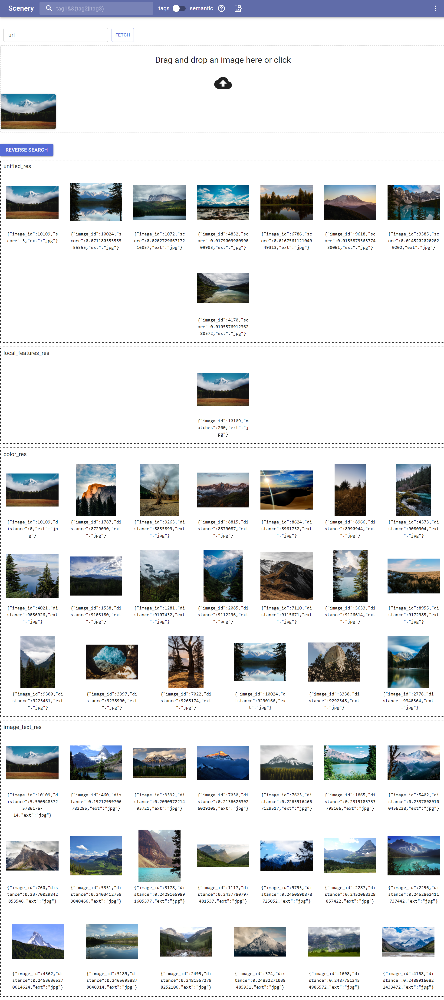
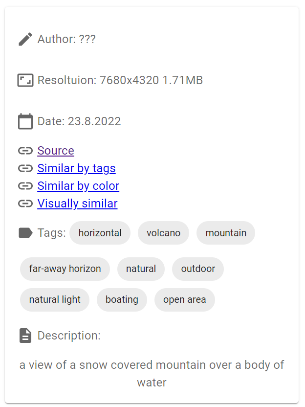
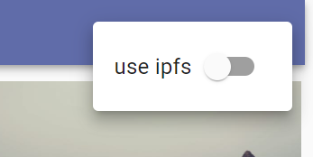
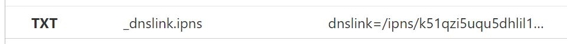
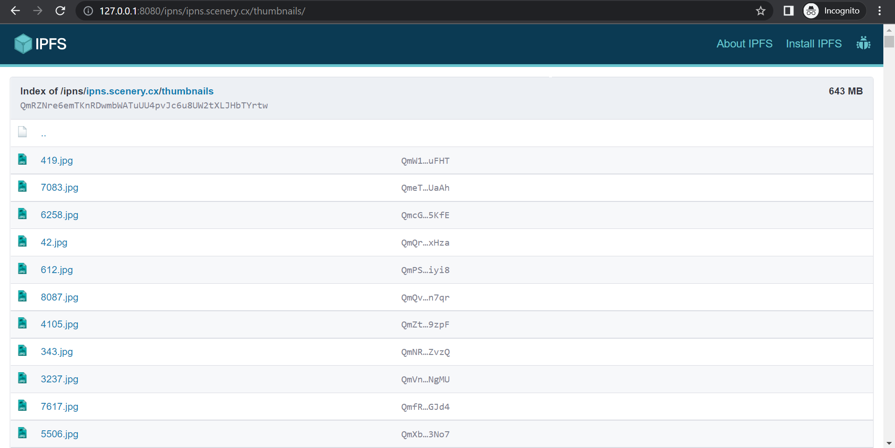
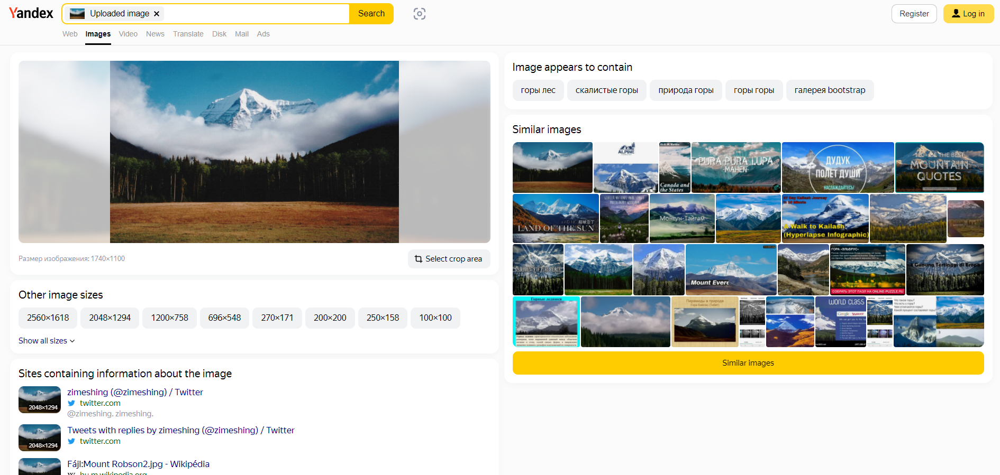
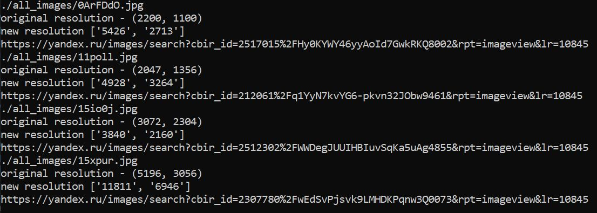

Self-hosted photo gallery with advanced search capabilities.  
https://scenery.cx

Current stack:
- Node.js + TypeScript
- [ambience](https://github.com/qwertyforce/ambience)
- Fastify
- MongoDB
- Next.js
- MUI
- sharp

# Image Grid
Using css, it is quite difficult (or almost impossible) to create a dynamic, responsive grid of images, where the images will maintain aspect ratio, and the rows are packed as much as possible. [Here](https://www.w3schools.com/howto/tryit.asp?filename=tryhow_css_image_grid_responsive) is an example of a css grid.  
For generating image grid, [react-photo-gallery](https://github.com/neptunian/react-photo-gallery) is used. This library uses an adaptation of the Knuth-Plass algorithm for line wrapping (this algorithm is also used in TeX for line wrapping).
The algorithm creates a graph of possible wraps, where the vertex is the image on which the line wrap occurred, and the edge weight is  
```cost(targetRowHeight, the height of the row if the line is wrapped)```.  
The optimal placement of images is the shortest path in such a graph. i.e. we get uniformly packed rows closest to the required height.  


As the author mentions, their library is based on  [this blog article](http://blog.vjeux.com/2014/image/google-plus-layout-find-best-breaks.html) and [Google Photos blog article](https://medium.com/google-design/google-photos-45b714dfbed1) (under 2. Justified Gallery), I recommend to check them out to dive deep into this algorithm. 
At the moment the library is abandoned, so I forked it and merged some PRs allowing it to work with SSR. However, it seems that [react-photo-album](https://github.com/igordanchenko/react-photo-album) is a better fork (new and maintained), but I haven't looked into it yet. 

# Image optimization
Lossless compression is used on all added images.  
Supported types: jpeg, png.  
Jpeg is compressed using jpegtran (I recommend installing it from libjpeg-turbo-progs)  
[Here](https://gist.github.com/sergejmueller/088dce028b6dd120a16e) are some benchmarks between mozjpeg and libjpeg-turbo  
>mozjpeg generates 1,18% smaller* files as libjpeg-turbo  
mozjpeg is 2,3x slower* as libjpeg-turbo

In my experience, it saves around 6% of file size. 

Png is compressed by [Oxipng](https://github.com/shssoichiro/oxipng/) (Multithreaded optipng rewrite in Rust)  
here are the results on a random image (8.94 MB):
- ```oxipng -o2``` – 5.97 MB, 5 seconds
- ```optipng -o2``` – 5.92 MB, 34 seconds

Something like jpegxl would be cool, but it's not supported by most browsers yet.

# Generation of thumbnails
[sharp](https://github.com/lovell/sharp) is used for thumbnail generation. Sharp uses libvips, which is really [fast](https://github.com/libvips/libvips/wiki/Speed-and-memory-use). Thumbnails are downscaled with respect to aspect ratio, the biggest side is 750px.  
Sharp options: ```{ quality: 80, mozjpeg: true }```. Thumbnails are saved as jpeg. I checked webp but found it to be of worse quality if we compare jpeg and webp image with the same size.

# Search
Image search functionality is provided by [ambience](https://github.com/qwertyforce/ambience).
Here's a [link](https://github.com/qwertyforce/ambience/blob/main/how_it_works_search.md) to a document, that briefly explains what it does and how it works.    
Search bar provides you with two different types of search: tag-based search and semantic search.  
  

Tag-based search uses tags generated by ambience. It supports logical operators.
>Available logical operators: && , ||, !, -, ,(comma)  Examples:  
>1) winter&&(forest||field)
>2) autumn, -forest
>3) winter&&!(forest||tree)

>Available comparison operators (only works with width/height): ==,>=,<=,<,>
>1) sea&&width==1920&&height==1080
>2) mountains,width>2000,height>2000
>3) water && width<1000&&height<1000  

This is how logical operators work in MongoDB:
```
db.things.find({
    $and: [
        {
            $or: [{ "first_name": "john" }, { "last_name": "john" }]
        },
        { "phone": "12345678" }
    ]
})
```
which is equivalent to ```({"first_name" : "john"} ||  {"last_name" : "john"}) && {"phone": "12345678"}```. Looks like AST, so I've written a function [(mongodb_logical_expression_parser)](https://github.com/qwertyforce/mongodb_logical_expression_parser) to build AST. It uses [Shunting_yard_algorithm](https://en.wikipedia.org/wiki/Shunting_yard_algorithm) and is not very well-written :D. It works though.  
```
build_ast("forest&&height>=1920&&width>=1080")
=>
{
   "$and":[
      {
         "$and":[
            {"tags":"forest"},
            {"height":{"$gte":1920}}
         ]
      },
      {"width":{"$gte":1080}}
   ]
}
```
Semantic search uses ambience (image_text_features_web).  

Reverse Search uses color_web, image_text_features_web and local_features_web:  


You can find images with similar color palette, visuals/semantics, and similar tags.  
  

"Similar by tags" ranks images by amount of shared tags. 
"Similar by color" and "Visually similar" use ambience (color_web and image_text_features_web respectively). 

# IPFS 
IPFS (Inter Planetary File system) is a content-addressable p2p file sharing network. We can use it for decentralized storage/distribution of images.
We will make a toggle switch, when activated, all links to images and thumbnails will be converted to ipfs links.  
  
Usually, links to files look like this: /ipfs/[CID], where CID is the Content Identifier (hash). This means that we need to store CIDs of images in the db and share these CIDs with the client. 
It is not very convenient. This problem can be elegantly solved using IPNS. IPNS (InterPlanetary Name System) is a decentralized version of dns for ipfs. It allows you to use an address that points to the hash of a file (folder). You can change the hash referenced by the address without changing the address. With this trick, we turned content-based addressing into address-based. 
IPNS is quite difficult to remember /ipns/k51qzi5uqu5dhlil169t1my3wmb5zzwugvtjcq6duc2bhgcbjsbc77wmdqwbsh, so we use dnslink – ipfs can pull the ipns address from the domain's TXT record.  



Now, the link to the file looks like this http://127.0.0.1:8080/ipns/ipns.scenery.cx/thumbnails/71.jpg (As you might have guessed, it works only after installing the IPFS client).  
  

Interesting fact: ipfs clients distribute files they have just downloaded for 30 minutes. So, IPFS can be used as distributed CDN, where clients can help in distributing your site's content. Neat.  
Snap back to the reality: this will probably never work as well as it sounds because it requires users to install an IPFS client, which almost none will do. It also requires for IPFS to be a fast and reliable technology ;)

# What happens when you import an image?
Lots of stuff  
1. check if the image is in the db by sha256
2. use ambience(local_features_web) to find duplicates
3. if everything is good, optimize the image, generate a thumbnail
4. generate tags (ambience, places365_tagger_web) and caption (ambience, image_caption_web)
5. generating features of ambience(color_web, local_features_web and image_text_features_web)

# Image mining
scenery.cx consist of images from [/r/EarthPorn](https://www.reddit.com/r/EarthPorn/)  and [/r/LandscapePhotography](https://www.reddit.com/r/LandscapePhotography/). I didn't save links to original posts while parsing, that's why currently all source links link to nowhere.     <sup><sub>it's just a demo who cares.</sub></sup>
The official Reddit API does not allow you to get more than 1000 recent posts. That's why a third-party Reddit API from https://pushshift.io was used.

# Image tools
*just PoC's, not really useful* 
## Finding the same image, but in higher resolution
Using Yandex Image Search (which in my opinion is the best image search system) we can try to find the same image but in higher resolution. All we need to do is send a usual image search request (there's no API, you have to parse).

You can't automatically replace the old image with a new one – quite often an image with a higher resolution turns out to be just an upscale of the original, or the resolution is larger, but the quality is lower. Therefore, you will have to compare the new image with the old one manually. <sup><sub>Bypassing the rate-limit, js challenges, and captcha is left as an exercise to the reader. Though, if you don't abuse it really hard, none of it will be your problem</sub></sup>
  

## Detection of upscaled images
Python script that calls [resdet](https://github.com/0x09/resdet). Not very effective, lots of false positives.
## Border detection and removal tool
Python script that tries to detect and remove a possible border, using the color of (0,0) pixel. Sometimes can be useful

# What's next
*just thoughts, not implemented*
### Ditch MongoDB for PostgreSQL
if your gallery has more than 1 million images, I believe that PostgreSQL will be faster and have less memory consumption.

### backend and frontend code are so intertwined, that some parts of backend code are built twice: by nextjs and by the main server at index.ts.
I don't like how unsecure next.js is, there are a lot of problems with it, but it works. SSG and SSR a really good features of next.js.

### Automatic image mining
```#I also come up with another acronym - AID (automatic image discovery)```  
For automatic image mining, a module is needed to calculate how well the image fits the dataset. Most likely, this can be done using features generated by ambience, creating several clusters using K-means, and assuming that the image suits us if the distance between the new picture and some cluster is less than a certain threshold value. I haven't tested this idea yet.

An algorithm is also needed to determine the visual quality of the image, resolution alone is not enough. So far, we have to evaluate the quality manually. This module is probably one of the most important: it will improve the system at all levels, from deduplication, it will be possible to leave a version of the image with better quality,~~and not the one with more pixels, as it works now~~(i removed this), to automatic mining.

Several strategies come to mind:

- Scan the Internet using your own search robot (technically difficult to implement). I also had an idea of using mcts somehow.

- Manual search for image sources (certain sites/subreddits) and their subsequent periodic parsing

- Using services like Yandex reverse image search. There is a section of similar images, it can be parsed and we can do something similar to a breadth-first search: we will find similar images to those that are already in the dataset, then we will find similar ones to similar ones, and so on

It would be cool if web 4.0 (web 3.0 is stolen by a cult of sha256 bruteforce enjoyers) would be something in a line of autonomous self–learning services where users can participate in the distribution of content. Sounds futuristic.
#
If you found any inaccuracies or have something to add, feel free to submit PR or raise an issue.
